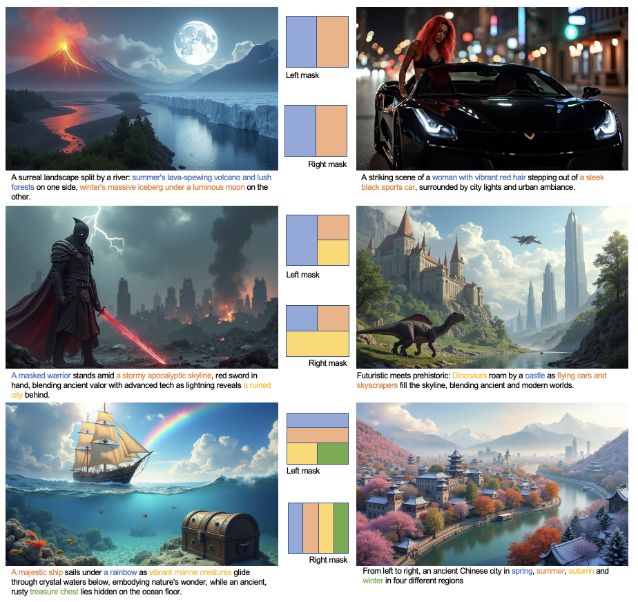
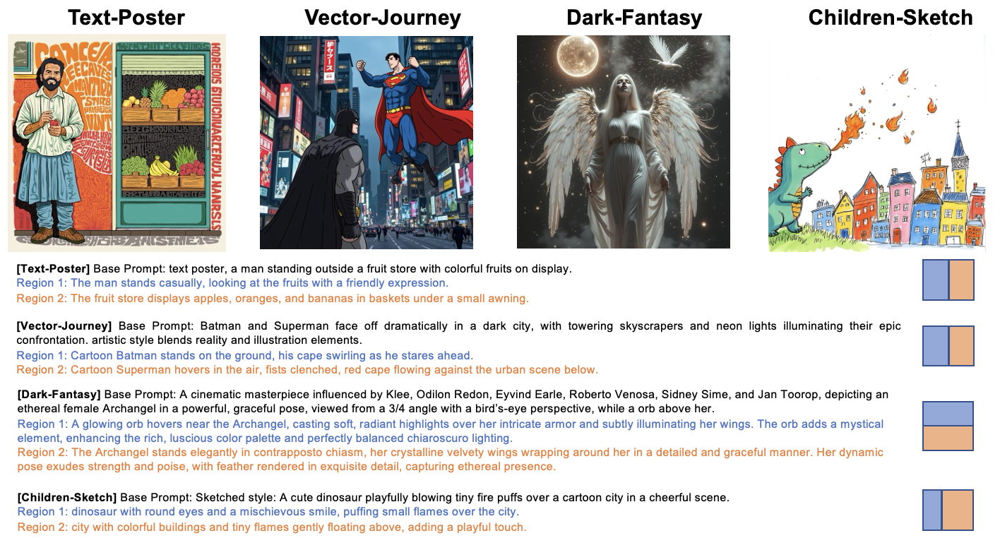
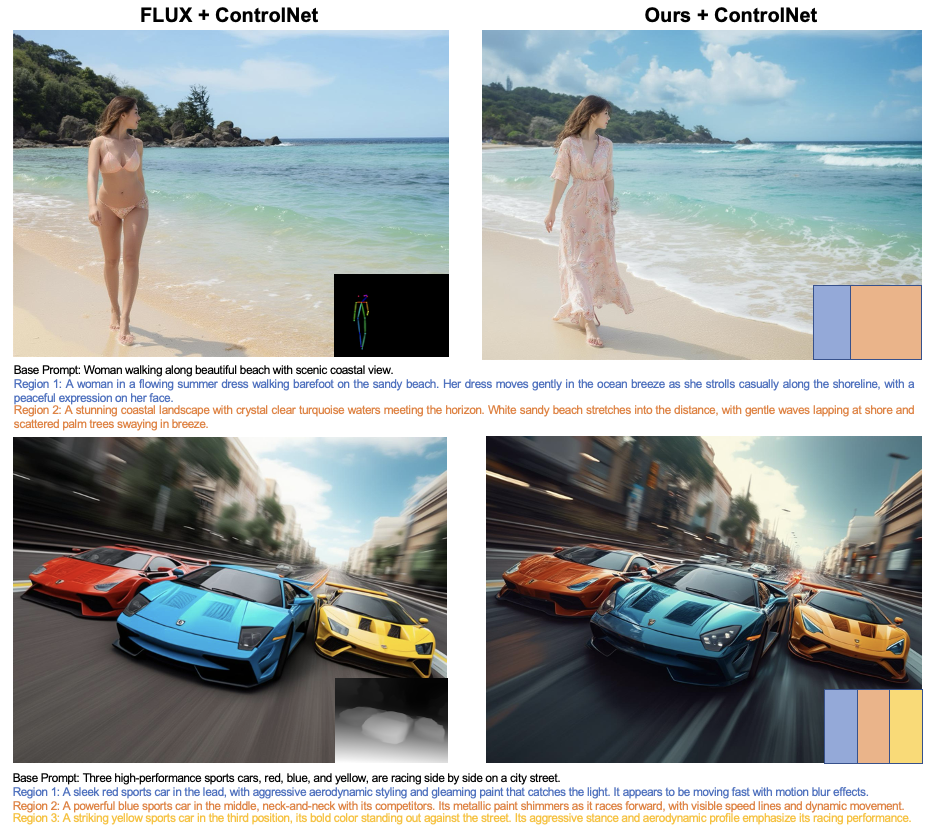

<div align="center">
<h1>Regional</h1>

[**Anthony Chen**](https://atchen.com/) · [**Haofan Wang**](https://haofanwang.github.io/)

<a href='#'></a>
[]

</div>

Regional-Prompting-FLUX enables Diffusion Transformers (i.e., FLUX) with find-grained compositional text-to-image generation capability in a training-free manner. Empirically, we show that our method is highly effective and compatible with LoRA and ControlNet.

<!--  -->

<div align="center">

</div>

## Release
- [2024/04/03] 🔥 We release the [technical report](#).

## Demos

### Custom Regional Control

<p align="center">
  
</p>

### LoRA Compatability

<p align="center">
  
</p>

### ControlNet Compatability

<p align="center">
  
</p>

### Highly Effective (with less inference time and GPU memory consumption)

<p align="center">
  
</p>

## Installation
```
# install diffusers locally
git clone https://github.com/huggingface/diffusers.git
cd diffusers
pip install -e ".[torch]"
cd ..

# install other dependencies
pip install -U transformers

# clone this repo
git clone https://github.com/antonioo-c/Regional-Prompting-FLUX.git

# replace file in diffusers
cp transformer_flux.py ../diffusers/src/diffusers/models/transformers/transformer_flux.py
```

## Usage

See detailed example in [infer_flux_regional.py](infer_flux_regional.py).


## Cite
If you find Regional-Prompting-FLUX useful for your research and applications, please cite us using this BibTeX:

```bibtex
HAHA
```

For any question, feel free to contact us via antonchen@pku.edu.cn.