<div align="center">
<h1>Training-free Regional Prompting for Diffusion Transformers</h1>

[**Anthony Chen**](https://atchen.com/)<sup>1,2</sup> · [**Jianjin Xu**](#)<sup>3</sup> · [**Wenzhao Zheng**](#)<sup>4</sup> · [**Gaole Dai**](#)<sup>1</sup> · [**Yida Wang**](#)<sup>5</sup> · [**Renrui Zhang**](#)<sup>6</sup> · [**Haofan Wang**](https://haofanwang.github.io/)<sup>2</sup> · [**Shanghang Zhang**](#)<sup>1*</sup>

<sup>1</sup>Peking University · <sup>2</sup>InstantX Team · <sup>3</sup>Carnegie Mellon University · <sup>4</sup>UC Berkeley · <sup>5</sup>Li Auto Inc. · <sup>6</sup>CUHK

<a href='https://arxiv.org/abs/2411.02395'></a>

</div>

Training-free Regional Prompting for Diffusion Transformers(Regional-Prompting-FLUX) enables Diffusion Transformers (i.e., FLUX) with find-grained compositional text-to-image generation capability in a training-free manner. Empirically, we show that our method is highly effective and compatible with LoRA and ControlNet.

<!--  -->

<div align="center">
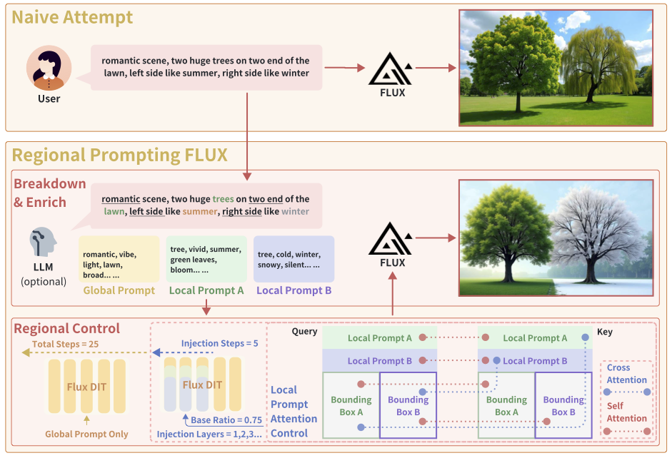
</div>

We inference at speed **much faster** than the [RPG-based](https://github.com/YangLing0818/RPG-DiffusionMaster) implementation, yet take up **less GPU memory**.

<p align="center">
  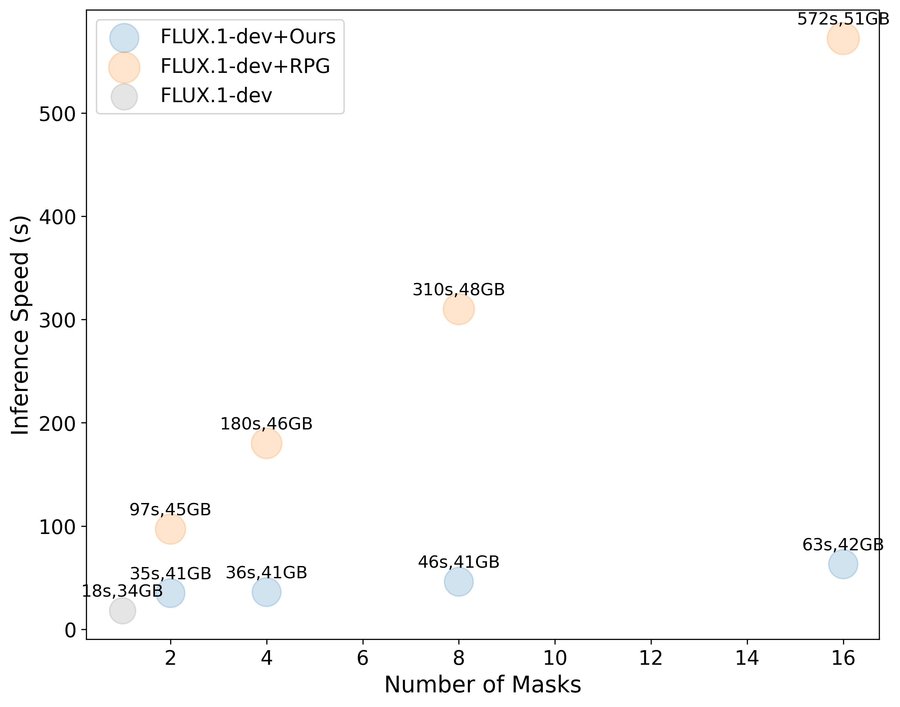
</p>

## Installation
We use previous commit from diffusers repo to ensure reproducibility, as we found new diffusers version may experience different results.
```bash
sudo apt-get update && sudo apt-get install git-lfs ffmpeg cbm
```

```
# install diffusers locally
git clone https://github.com/huggingface/diffusers.git
cd diffusers

# reset diffusers version to 0.31.dev, where we developed Regional-Prompting-FLUX on, different version may experience different results
git reset --hard d13b0d63c0208f2c4c078c4261caf8bf587beb3b
pip install -e ".[torch]"
cd ..

# install other dependencies
pip install -U transformers sentencepiece protobuf PEFT

# clone this repo
git clone https://github.com/antonioo-c/Regional-Prompting-FLUX.git

# replace file in diffusers
cd Regional-Prompting-FLUX
cp transformer_flux.py ../diffusers/src/diffusers/models/transformers/transformer_flux.py
huggingface-cli login
```

# Regional Flux Pipeline README
# Take Genshin Imapct Character named with shenhe as a Example 


This README provides a guide on how to use the Regional Flux Pipeline, a powerful tool for generating images with regional control using PyTorch. The pipeline allows you to specify different prompts for different regions of the image, enabling fine-grained control over the generated content.

## Usage

### Step 1: Load the Pipeline

First, load the Regional Flux Pipeline from a pretrained model and set the desired data type:

```python
import torch
from pipeline_flux_regional import RegionalFluxPipeline, RegionalFluxAttnProcessor2_0

pipeline = RegionalFluxPipeline.from_pretrained("black-forest-labs/FLUX.1-dev", torch_dtype=torch.bfloat16)
pipeline.load_lora_weights("svjack/FLUX_Shenhe_Lora" ,"tj_f1_shenhe_v1.safetensors")
pipeline.to("cuda")
```

### Step 2: Configure Attention Processors

Next, configure the attention processors to use the `RegionalFluxAttnProcessor2_0` for specific attention layers:

```python
attn_procs = {}
for name in pipeline.transformer.attn_processors.keys():
    if 'transformer_blocks' in name and name.endswith("attn.processor"):
        attn_procs[name] = RegionalFluxAttnProcessor2_0()
    else:
        attn_procs[name] = pipeline.transformer.attn_processors[name]
pipeline.transformer.set_attn_processor(attn_procs)
```

### Step 3: Set General Settings

Define the general settings for the image generation:

```python
image_width = 1280
image_height = 768
num_inference_steps = 24
seed = 124

base_prompt = "A snowy chinese hill in the background, A big sun rises."
background_prompt = "a photo of a snowy chinese hill"
```

### Step 4: Define Regional Prompts and Masks

Specify the regional prompts and corresponding masks for different parts of the image:

```python
regional_prompt_mask_pairs = {
    "0": {
        "description": "A dignified woman stands in the foreground, her sliver hair and long braid adorned with a hair ornament, her face illuminated by the cold light of the snow. Her expression is one of determination and sorrow, her clothing and appearance reflecting the historical period. The snow casts a serene yet dramatic light across her features, its cold embrace enveloping her in a world of ice and frost. tj_sthenhe, hair ornament, sliver hair, long hair, braid.",
        "mask": [128, 128, 640, 768]
    }
}
```

### Step 5: Configure Region Control Factors

Set the control factors for region-specific attention injection:

```python
mask_inject_steps = 10
double_inject_blocks_interval = 1
single_inject_blocks_interval = 1
base_ratio = 0.2
```

### Step 6: Generate the Image

Generate the image using the specified prompts and masks:

```python
regional_prompts = []
regional_masks = []
background_mask = torch.ones((image_height, image_width))

for region_idx, region in regional_prompt_mask_pairs.items():
    description = region['description']
    mask = region['mask']
    x1, y1, x2, y2 = mask
    mask = torch.zeros((image_height, image_width))
    mask[y1:y2, x1:x2] = 1.0
    background_mask -= mask
    regional_prompts.append(description)
    regional_masks.append(mask)

if background_mask.sum() > 0:
    regional_prompts.append(background_prompt)
    regional_masks.append(background_mask)

image = pipeline(
    prompt=base_prompt,
    width=image_width, height=image_height,
    mask_inject_steps=mask_inject_steps,
    num_inference_steps=num_inference_steps,
    generator=torch.Generator("cuda").manual_seed(seed),
    joint_attention_kwargs={
        "regional_prompts": regional_prompts,
        "regional_masks": regional_masks,
        "double_inject_blocks_interval": double_inject_blocks_interval,
        "single_inject_blocks_interval": single_inject_blocks_interval,
        "base_ratio": base_ratio
    },
).images[0]

image.save(f"shenhe_in_snow_hill.jpg")
```
### Step 7: Display the Image

Display the generated image:

```python
from IPython import display
display.Image("shenhe_in_snow_hill.jpg", width=512, height=512)
```


### Step 8: Draw a Transparent Rectangle

Optionally, draw a transparent rectangle on the generated image to highlight a specific region:

```python
from PIL import Image, ImageDraw

def draw_transparent_rectangle(image_path, bbox, color, alpha=128, output_path=None):
    """
    在指定区域绘制一个半透明的矩形，并将修改后的图片保存到本地新路径。

    :param image_path: 图片路径
    :param bbox: 长度为4的列表，表示矩形的边界框 [x1, y1, x2, y2]
    :param color: 颜色，格式为 (R, G, B)
    :param alpha: 透明度，范围为 0（完全透明）到 255（完全不透明），默认值为 128
    :param output_path: 保存修改后图片的路径，如果为 None，则覆盖原图
    :return: 修改后的图片对象
    """
    image = Image.open(image_path).convert("RGBA")
    overlay = Image.new('RGBA', image.size, (0, 0, 0, 0))
    draw = ImageDraw.Draw(overlay)

    x1, y1, x2, y2 = bbox
    draw.rectangle([x1, y1, x2, y2], fill=(*color, alpha))

    image = Image.alpha_composite(image, overlay)

    if output_path is None:
        output_path = image_path

    image.save(output_path)
    return image

draw_transparent_rectangle("shenhe_in_snow_hill.jpg", [128, 128, 640, 768], (255, 0, 0), alpha=128, output_path="shenhe_in_snow_hill_rec.png")
display.Image("shenhe_in_snow_hill_rec.png", width=512, height=512)
```


### 以下是对应提示词的中文翻译：

- `base_prompt`: "背景是雪中的中国山丘，一轮大太阳正在升起。"
- `background_prompt`: "一张雪中的中国山丘的照片"

`regional_prompt_mask_pairs` 中的内容翻译如下：

```json
{
    "0": {
        "description": "一位端庄的女子站在前景中，她的银发和长辫子上装饰着发饰，她的脸被雪的冷光照亮。她的表情既坚定又悲伤，她的服装和外貌反映了历史时期。雪花在她脸上投下宁静而戏剧性的光线，它的寒冷拥抱将她包裹在冰雪世界中。tj_sthenhe，发饰，银发，长发，辫子。",
        "mask": [128, 128, 640, 768]
    }
}
```

## Release
- [2024/11/05] 🔥 We release the code, feel free to try it out!
- [2024/11/05] 🔥 We release the [technical report](https://arxiv.org/abs/2411.02395)!

## Demos

### Custom Regional Control

<table align="center">
  <tr>
    <th>Regional Masks</th>
    <th>Configuration</th>
    <th>Generated Result</th>
  </tr>
  <tr>
    <td width="10%">
      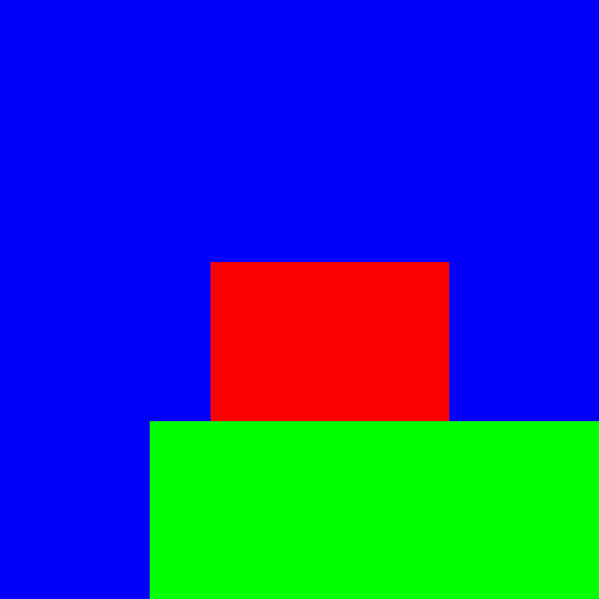
      <br>
      <small><i>Red: Cocktail region (xyxy: [450, 560, 960, 900])<br>Green: Table region (xyxy: [320, 900, 1280, 1280])<br>Blue: Background</i></small>
    </td>
    <td width="40%">
      <b>Base Prompt:</b><br>
      "A tropical cocktail on a wooden table at a beach during sunset."
      <br><br>
      <b>Background Prompt:</b><br>
      "A photo"
      <br><br>
      <b>Regional Prompts:</b>
      <ul>
        <li><b>Region 0:</b> "A colorful cocktail in a glass with tropical fruits and a paper umbrella, with ice cubes and condensation."</li>
        <li><b>Region 1:</b> "Weathered wooden table with seashells and a napkin."</li>
      </ul>
      <b>Settings:</b>
      <ul>
        <li>Image Size: 1280x1280</li>
        <li>Seed: 124</li>
        <li>Mask Inject Steps: 10</li>
        <li>Double Inject Interval: 1</li>
        <li>Single Inject Interval: 2</li>
        <li>Base Ratio: 0.1</li>
      </ul>
    </td>
    <td width="50%">
      
    </td>
  </tr>
  <tr>
    <td width="10%">
      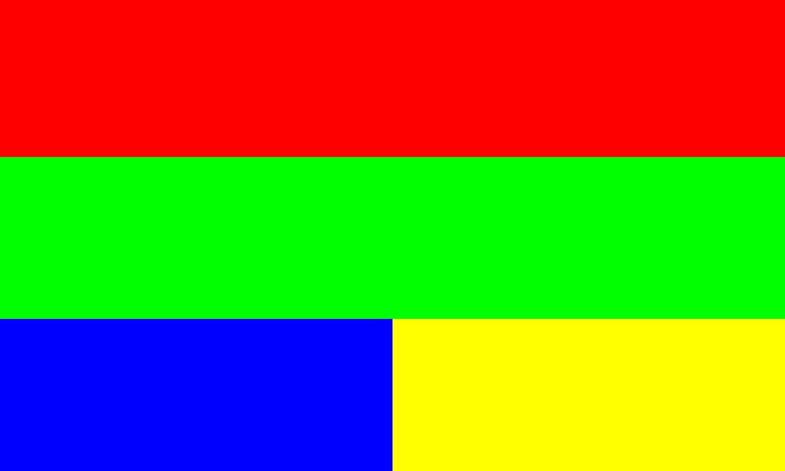
      <br>
      <small><i>Red: Rainbow region (xyxy: [0, 0, 1280, 256])<br>Green: Ship region (xyxy: [0, 256, 1280, 520])<br>Yellow: Fish region (xyxy: [0, 520, 640, 768])<br>Blue: Treasure region (xyxy: [640, 520, 1280, 768])</i></small>
    </td>
    <td width="40%">
      <b>Base Prompt:</b><br>
      "A majestic ship sails under a rainbow as vibrant marine creatures glide through crystal waters below, embodying nature's wonder, while an ancient, rusty treasure chest lies hidden on the ocean floor."
      <br><br>
      <b>Regional Prompts:</b>
      <ul>
        <li><b>Region 0:</b> "A massive, radiant rainbow arches across the vast sky, glowing in vivid colors and blending with ethereal clouds that drift gently, casting a magical light across the scene and creating a surreal, dreamlike atmosphere."</li>
        <li><b>Region 1:</b> "The majestic ship, with grand sails billowing against the crystal blue waters, glides forward as birds soar overhead. Its hull and sails mirror the vivid hues of the sea, embodying a sense of adventure and mystery as it journeys through this enchanted world."</li>
        <li><b>Region 2:</b> "Beneath the sparkling water, schools of colorful fish dart playfully, their scales flashing in shades of yellow, blue, and orange. Tiny seahorses drift by, while gentle turtles paddle along, creating a lively, enchanting underwater scene."</li>
        <li><b>Region 3:</b> "On the ocean floor lies an ancient, rusty treasure chest, heavily encrusted with barnacles and seaweed. The chest's corroded metal and weathered wood hint at centuries spent underwater. Its lid is slightly ajar, revealing a faint glow within, as small fish dart around, adding an air of mystery to the forgotten relic."</li>
      </ul>
      <b>Settings:</b>
      <ul>
        <li>Image Size: 1280x768</li>
        <li>Seed: 124</li>
        <li>Mask Inject Steps: 10</li>
        <li>Double Inject Interval: 1</li>
        <li>Single Inject Interval: 1</li>
        <li>Base Ratio: 0.2</li>
      </ul>
    </td>
    <td width="50%">
      
    </td>
  </tr>
  <tr>
    <td width="10%">
      
      <br>
      <small><i>Red: Woman with torch region (xyxy: [128, 128, 640, 768])</i></small>
      <br><small><i>Green: Background</i></small>
    </td>
    <td width="40%">
      <b>Base Prompt:</b><br>
      "An ancient woman stands solemnly holding a blazing torch, while a fierce battle rages in the background, capturing both strength and tragedy in a historical war scene."
      <br><br>
      <b>Background Prompt:</b><br>
      "A photo."
      <br><br>
      <b>Regional Prompts:</b>
      <ul>
        <li><b>Region 0:</b> "A dignified woman in ancient robes stands in the foreground, her face illuminated by the torch she holds high. Her expression is one of determination and sorrow, her clothing and appearance reflecting the historical period. The torch casts dramatic shadows across her features, its flames dancing vibrantly against the darkness."</li>
      </ul>
      <b>Settings:</b>
      <ul>
        <li>Image Size: 1280x768</li>
        <li>Seed: 124</li>
        <li>Mask Inject Steps: 10</li>
        <li>Double Inject Interval: 1</li>
        <li>Single Inject Interval: 1</li>
        <li>Base Ratio: 0.3</li>
      </ul>
    </td>
    <td width="50%">
      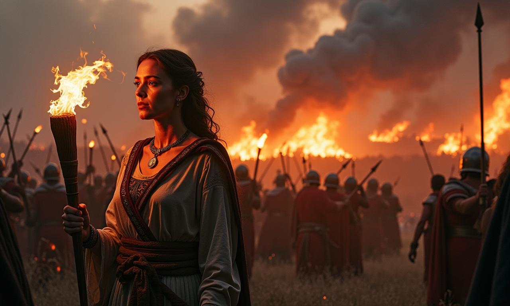
    </td>
  </tr>
  <tr>
    <td width="10%">
      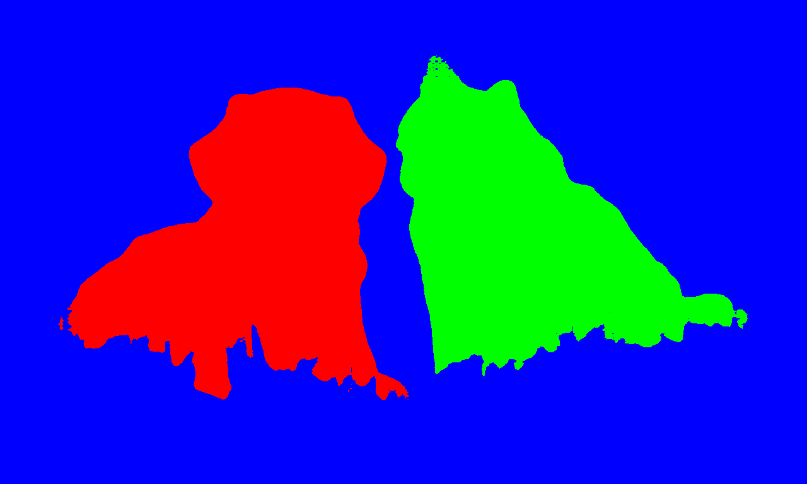
      <br>
      <small><i>Red: Dog region (assets/demo_custom_0_mask_0.png)<br>Green: Cat region (assets/demo_custom_0_mask_1.png)<br>Blue: Background</i></small>
    </td>
    <td width="40%">
      <b>Base Prompt:</b><br>
      "dog and cat sitting on lush green grass, in a sunny outdoor setting."
      <br><br>
      <b>Background Prompt:</b><br>
      "A photo"
      <br><br>
      <b>Regional Prompts:</b>
      <ul>
        <li><b>Region 0:</b> "A friendly golden retriever with a luxurious golden coat, floppy ears, and warm expression sitting on vibrant green grass."</li>
        <li><b>Region 1:</b> "A golden british shorthair cat with round face, plush coat, and copper eyes sitting regally"</li>
      </ul>
      <b>Settings:</b>
      <ul>
        <li>Image Size: 1280x768</li>
        <li>Seed: 124</li>
        <li>Mask Inject Steps: 10</li>
        <li>Double Inject Interval: 1</li>
        <li>Single Inject Interval: 2</li>
        <li>Base Ratio: 0.1</li>
      </ul>
    </td>
    <td width="50%">
      
      <br>
      <small><i>Note: Generation with segmention mask is a experimental function, the generated image is not perfectly constrained by the regions, we assume it is because the mask suffers from degradation during the downsampling process.</i></small>
    </td>
  </tr>
</table>

### LoRA Compatability

<table align="center">
  <tr>
    <th>Regional Masks</th>
    <th>Configuration</th>
    <th>Generated Result</th>
  </tr>
  <tr>
    <td width="20%">
      
      <br>
      <small><i>Red: Dinosaur region (xyxy: [0, 0, 640, 1280])</i></small>
      <small><i>Blue: City region (xyxy: [640, 0, 1280, 1280])</i></small>
    </td>
    <td width="40%">
      <b>Base Prompt:</b><br>
      "Sketched style: A cute dinosaur playfully blowing tiny fire puffs over a cartoon city in a cheerful scene."
      <br><br>
      <b>Regional Prompts:</b>
      <ul>
        <li><b>Region 0:</b> "Sketched style, dinosaur with round eyes and a mischievous smile, puffing small flames over the city."</li>
        <li><b>Region 1:</b> "Sketched style, city with colorful buildings and tiny flames gently floating above, adding a playful touch."</li>
      </ul>
      <b>Settings:</b>
      <ul>
        <li>Image Size: 1280x1280</li>
        <li>Seed: 1298</li>
        <li>Mask Inject Steps: 10</li>
        <li>Double Inject Interval: 1</li>
        <li>Single Inject Interval: 1</li>
        <li>Base Ratio: 0.1</li>
      </ul>
      <b>LoRA:</b>
      <ul>
        <li>Path: Shakker-Labs/FLUX.1-dev-LoRA-Children-Simple-Sketch</li>
        <li>Scale: 1.5</li>
        <li>Trigger Words: "sketched style"</li>
      </ul>
    </td>
    <td width="40%">
      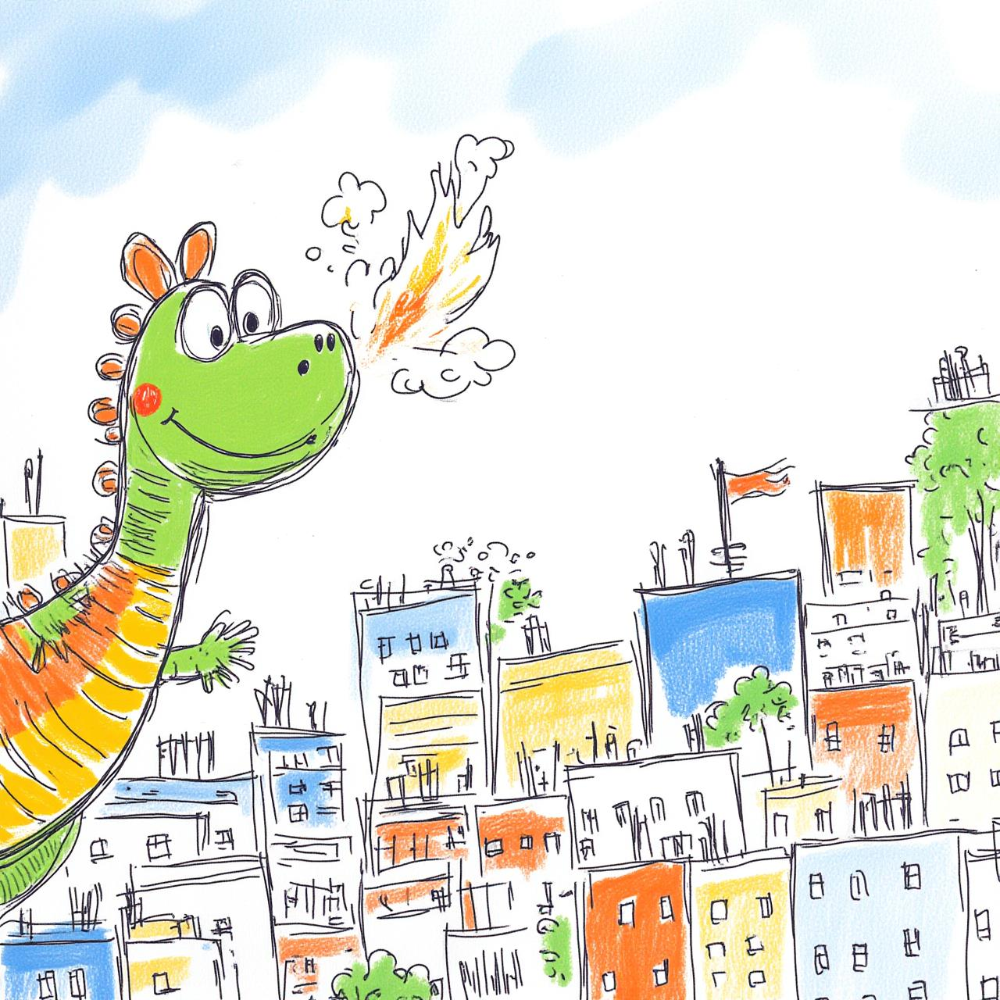
    </td>
  </tr>
  <tr>
    <td width="20%">
      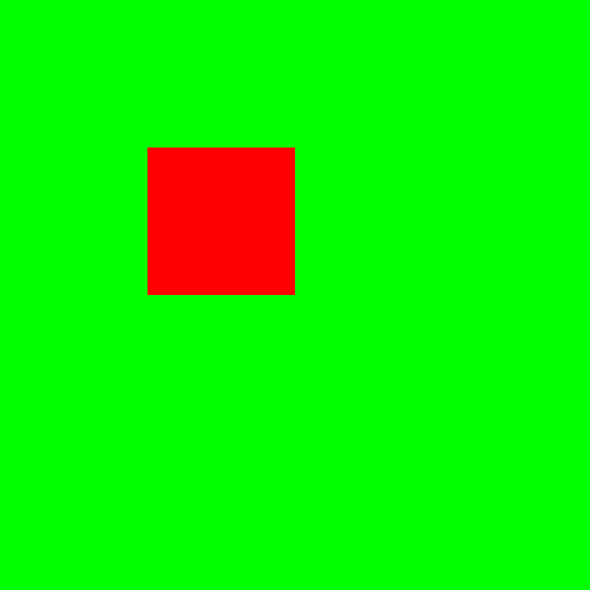
      <br>
      <small><i>Red: UFO region (xyxy: [320, 320, 640, 640])</i></small>
    </td>
    <td width="40%">
      <b>Base Prompt:</b><br>
      "A cute cartoon-style UFO floating above a sunny city street, artistic style blends reality and illustration elements"
      <br><br>
      <b>Background Prompt:</b><br>
      "A photo"
      <br><br>
      <b>Regional Prompts:</b>
      <ul>
        <li><b>Region 0:</b> "A cartoon-style silver UFO with blinking lights hovering in the air, artistic style blends reality and illustration elements"</li>
      </ul>
      <b>Settings:</b>
      <ul>
        <li>Image Size: 1280x1280</li>
        <li>Seed: 1298</li>
        <li>Mask Inject Steps: 10</li>
        <li>Double Inject Interval: 1</li>
        <li>Single Inject Interval: 2</li>
        <li>Base Ratio: 0.2</li>
      </ul>
      <b>LoRA:</b>
      <ul>
        <li>Path: Shakker-Labs/FLUX.1-dev-LoRA-Vector-Journey</li>
        <li>Scale: 1.0</li>
      </ul>
    </td>
    <td width="40%">
      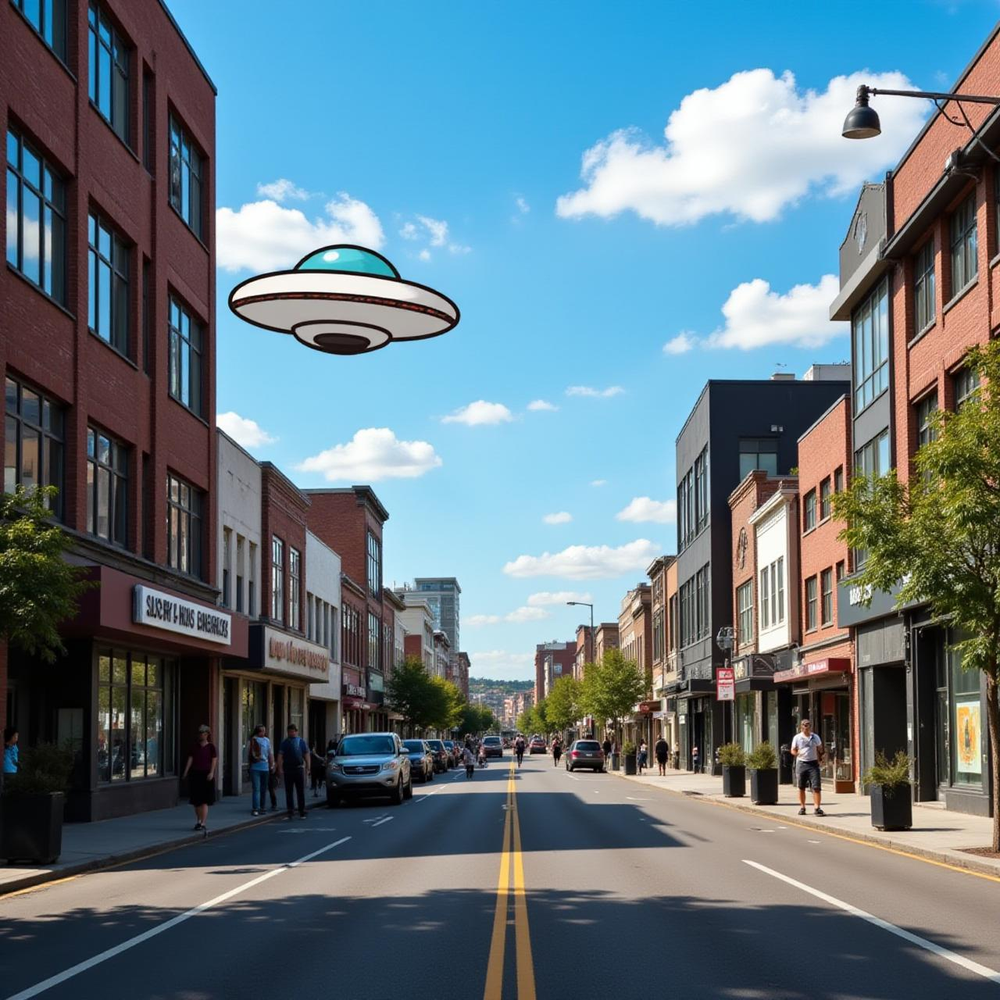
    </td>
  </tr>
</table>

### ControlNet Compatability

<table align="center">
  <tr>
    <th>Regional Masks</th>
    <th>Configuration</th>
    <th>Generated Result</th>
  </tr>
  <tr>
    <td width="20%">
      
      <br>
      <small><i>Red: First car region (xyxy: [0, 0, 426, 968])<br>
      Green: Second car region (xyxy: [426, 0, 853, 968])<br>
      Blue: Third car region (xyxy: [853, 0, 1280, 968])</i></small>
      <br><br>
      
    </td>
    <td width="40%">
      <b>Base Prompt:</b><br>
      "Three high-performance sports cars, red, blue, and yellow, are racing side by side on a city street"
      <br><br>
      <b>Regional Prompts:</b>
      <ul>
        <li><b>Region 0:</b> "A sleek red sports car in the lead position, with aggressive aerodynamic styling and gleaming paint that catches the light. The car appears to be moving at high speed with motion blur effects."</li>
        <li><b>Region 1:</b> "A powerful blue sports car in the middle position, neck-and-neck with its competitors. Its metallic paint shimmers as it races forward, with visible speed lines and dynamic movement."</li>
        <li><b>Region 2:</b> "A striking yellow sports car in the third position, its bold color standing out against the street. The car's aggressive stance and aerodynamic profile emphasize its racing performance."</li>
      </ul>
      <b>Settings:</b>
      <ul>
        <li>Image Size: 1280x968</li>
        <li>Seed: 124</li>
        <li>Mask Inject Steps: 10</li>
        <li>Double Inject Blocks Interval: 1</li>
        <li>Single Inject Blocks Interval: 2</li>
        <li>Base Ratio: 0.2</li>
      </ul>
      <b>ControlNet:</b>
      <ul>
        <li>Control Mode: 2</li>
        <li>ControlNet Conditioning Scale: 0.7</li>
      </ul>
    </td>
    <td width="40%">
      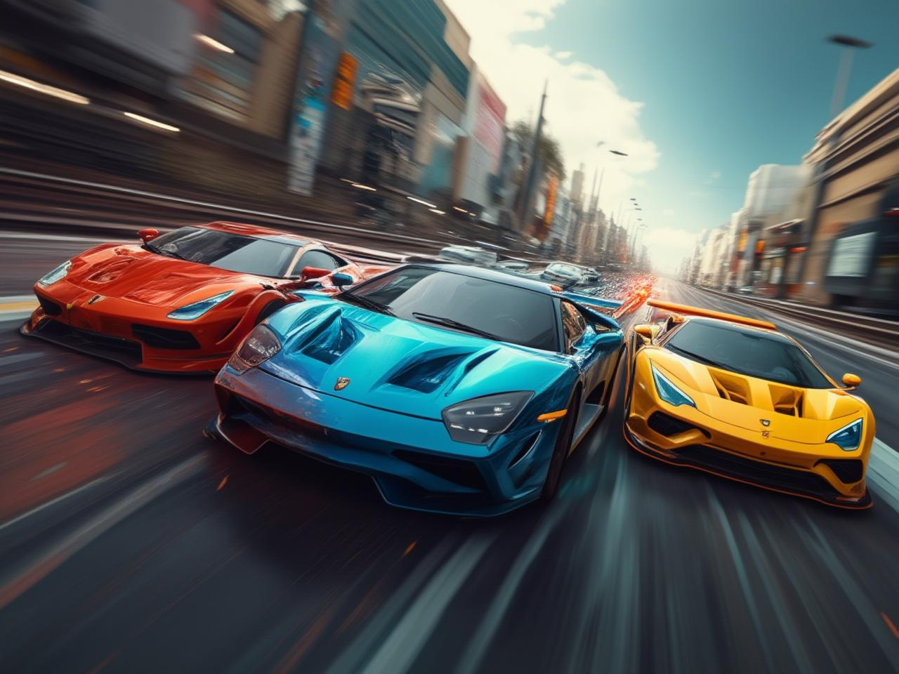
    </td>
  </tr>
  <tr>
    <td width="20%">
      
      <br>
      <small><i>Red: Woman region (xyxy: [0, 0, 640, 968])<br>
      Green: Beach region (xyxy: [640, 0, 1280, 968])</i></small>
      <br><br>
      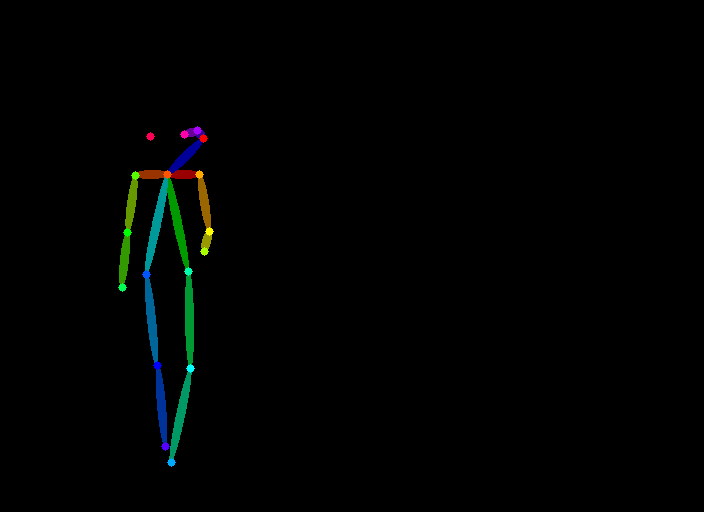
    </td>
    <td width="40%">
      <b>Base Prompt:</b><br>
      "A woman walking along a beautiful beach with a scenic coastal view."
      <br><br>
      <b>Regional Prompts:</b>
      <ul>
        <li><b>Region 0:</b> "A woman in a flowing summer dress with delicate pink and blue flower patterns walking barefoot on the sandy beach. Her floral-patterned dress billows gracefully in the ocean breeze as she strolls casually along the shoreline, with a peaceful expression on her face and her hair gently tousled by the wind."</li>
        <li><b>Region 1:</b> "A stunning coastal landscape with crystal clear turquoise waters meeting the horizon. Rhythmic waves roll in with white foamy crests, creating a mesmerizing pattern as they crash onto the shore. The waves vary in size, some gently lapping at the sand while others surge forward with more force. White sandy beach stretches into the distance, with gentle waves leaving intricate patterns on the wet sand and scattered palm trees swaying in the breeze."</li>
      </ul>
      <b>Settings:</b>
      <ul>
        <li>Image Size: 1280x968</li>
        <li>Seed: 124</li>
        <li>Mask Inject Steps: 10</li>
        <li>Double Inject Blocks Interval: 1</li>
        <li>Single Inject Blocks Interval: 2</li>
        <li>Base Ratio: 0.2</li>
      </ul>
      <b>ControlNet:</b>
      <ul>
        <li>Control Mode: 4</li>
        <li>ControlNet Conditioning Scale: 0.7</li>
      </ul>
    </td>
    <td width="40%">
      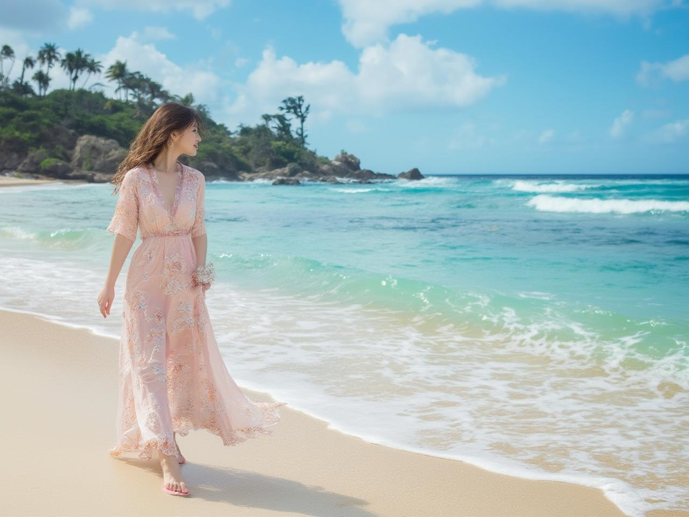
    </td>
  </tr>
</table>

## Quick Start
See detailed example (including LoRAs and ControlNets) in [infer_flux_regional.py](infer_flux_regional.py). Below is a quick start example.

```python
import torch
from pipeline_flux_regional import RegionalFluxPipeline, RegionalFluxAttnProcessor2_0

pipeline = RegionalFluxPipeline.from_pretrained("black-forest-labs/FLUX.1-dev", torch_dtype=torch.bfloat16).to("cuda")
attn_procs = {}
for name in pipeline.transformer.attn_processors.keys():
    if 'transformer_blocks' in name and name.endswith("attn.processor"):
        attn_procs[name] = RegionalFluxAttnProcessor2_0()
    else:
        attn_procs[name] = pipeline.transformer.attn_processors[name]
pipeline.transformer.set_attn_processor(attn_procs)

## general settings
image_width = 1280
image_height = 768
num_inference_steps = 24
seed = 124
base_prompt = "An ancient woman stands solemnly holding a blazing torch, while a fierce battle rages in the background, capturing both strength and tragedy in a historical war scene."
background_prompt = "a photo" # set by default, but if you want to enrich background, you can set it to a more descriptive prompt
regional_prompt_mask_pairs = {
    "0": {
        "description": "A dignified woman in ancient robes stands in the foreground, her face illuminated by the torch she holds high. Her expression is one of determination and sorrow, her clothing and appearance reflecting the historical period. The torch casts dramatic shadows across her features, its flames dancing vibrantly against the darkness.",
        "mask": [128, 128, 640, 768]
    }
}
## region control factor settings
mask_inject_steps = 10 # larger means stronger control, recommended between 5-10
double_inject_blocks_interval = 1 # 1 means strongest control
single_inject_blocks_interval = 1 # 1 means strongest control
base_ratio = 0.2 # smaller means stronger control

regional_prompts = []
regional_masks = []
background_mask = torch.ones((image_height, image_width))
for region_idx, region in regional_prompt_mask_pairs.items():
    description = region['description']
    mask = region['mask']
    x1, y1, x2, y2 = mask
    mask = torch.zeros((image_height, image_width))
    mask[y1:y2, x1:x2] = 1.0
    background_mask -= mask
    regional_prompts.append(description)
    regional_masks.append(mask)
# if regional masks don't cover the whole image, append background prompt and mask
if background_mask.sum() > 0:
    regional_prompts.append(background_prompt)
    regional_masks.append(background_mask)

image = pipeline(
    prompt=base_prompt,
    width=image_width, height=image_height,
    mask_inject_steps=mask_inject_steps,
    num_inference_steps=num_inference_steps,
    generator=torch.Generator("cuda").manual_seed(seed),
    joint_attention_kwargs={
        "regional_prompts": regional_prompts,
        "regional_masks": regional_masks,
        "double_inject_blocks_interval": double_inject_blocks_interval,
        "single_inject_blocks_interval": single_inject_blocks_interval,
        "base_ratio": base_ratio
    },
  ).images[0]

image.save(f"output.jpg")
```

## 👏 Acknowledgment
Our work is sponsored by [HuggingFace](https://huggingface.co) and [fal.ai](https://fal.ai). Thanks!

## Cite
If you find Regional-Prompting-FLUX useful for your research and applications, please cite us using this BibTeX:

```bibtex
@article{chen2024training,
  title={Training-free Regional Prompting for Diffusion Transformers},
  author={Chen, Anthony and Xu, Jianjin and Zheng, Wenzhao and Dai, Gaole and Wang, Yida and Zhang, Renrui and Wang, Haofan and Zhang, Shanghang},
  journal={arXiv preprint arXiv:2411.02395},
  year={2024}
}
```

For any question, feel free to contact us via antonchen@pku.edu.cn.
